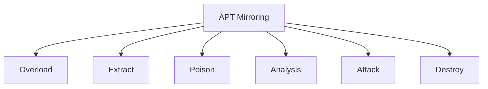

# Railgun: AI-Powered Offensive SIEM Platform


## Overview
Railgun is a next-generation **AI-driven SIEM system** with **counter-APT offensive capabilities**. Unlike traditional passive monitoring solutions, our platform combines:
- Real-time threat detection using machine learning
- Active response modules for counter-APT operations
- Advanced forensic investigation tools

> **Warning**: Offensive modules are designed for authorized active defense only. Use responsibly in compliance with all applicable laws.

## Architecture

| Layer       | Technology Stack                  | Description                                                                  |
|-------------|-----------------------------------|------------------------------------------------------------------------------|
| **Backend** | Go (bun, gin)                     | Handles all server-side operations via gRPC with JWT authentication          |
| **Frontend**| Vue.js + TypeScript               | Interactive dashboards with real-time attack visualization and control panel |
| **Data**    | Go (golang.org/x/sys/windows)     | Low-level OS interactions and security event collection                      |


## Current Status

```diff
+ Hotfix v1: Agent successfully migrated from C to Go
```

## Roadmap

### Stage 1 (Core Platform)

    - Complete gRPC endpoints (ETA: Q3 2024)

    - Implement Vue.js dashboard with:

        - Real-time attack maps

        - Threat heatmaps

        - Countermeasure controls

    - Dockerize all components

    - Enhance GraphQL API support

### Stage 2 (Offensive Modules)



Additional modules:

    - Forensic investigation toolkit

    - AI-assisted threat analysis

    - Browser-based reverse engineering
